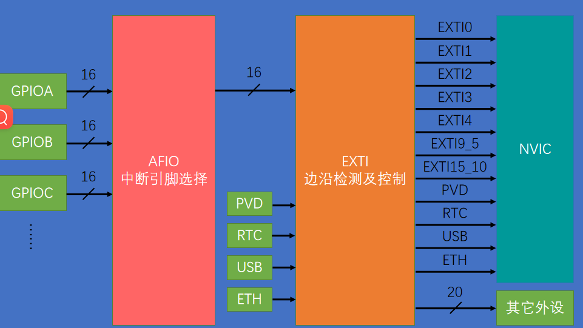
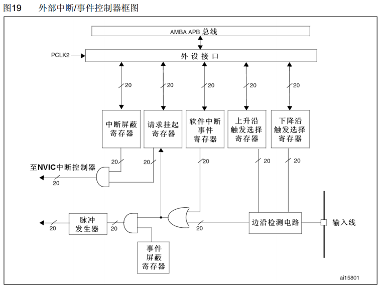

# 江协stm32笔记

## Stm32介绍

| 缩写 |名称 | 用途 |
| --- |--- |--- |
| NVIC | 嵌套向量中断控制器| 用途|
| SysTick |系统滴答定时器| 用途|
| RCC |复位和时钟控制| 用途|
| GPIO |通用IO口| 用途|
| AFIO |复用IO口| 用途|
| EXTI |外部中断| 用途|
| TIM |定时器| 用途|
| ADC |模数转换器| 用途|
| DAC |数模转换器| 用途|
| DMA |直接内存访问| 用途|
| USART |同步/异步串口通信| 用途|
| IIC |IIC通信| 用途|
| SPI |SPI通信| 用途|
| CAN |CAN通信| 用途|
| USB |USB通信| 用途|
| RTC |实时时钟| 用途|
| CRC |CRC校验| 用途|
| PWR |电源控制| 用途|
| BKP |备份寄存器| 用途|
| IWDG |独立看门狗| 用途|
| WWDG |窗口看门狗| 用途|

stm32 F103C8T6 这里F表示通用型，103表示产品子系列是增强型，C表示引脚数目是48，8表示闪存容量是64K，T表示封装类型是LQFP，6表示温度范围-40到85摄氏度

### STM32 F10X启动配置

|boot1|boot0|启动模式|说明|
|---|---|---|---|
|X|0|主闪存存储器|通常模式|
|0|1|系统存储器|一般用作串口下载程序|
|1|1|内置SRAM|一般用于程序调试|

BOOT引脚的值是在上电复位后系统的第四个脉冲上升沿起效，之后就不起作用了。

### STM32 最小系统

晶振，复位电路，启动配置，STM32芯片以及供电，下载端口

## 开发环境搭建

### Keil5安装

- 安装Keil5 MDK

- 安装器件支持包

- 软件注册

- 安装STLINK驱动

- 安装USB转串口驱动

### 新建工程模板

- 建立工程文件夹，Keil中新建工程，选择型号

- 工程文件夹里建立Start、Library、User等文件夹，复制固件库里面的文件到工程文件夹

- 工程里对应建立Start、Library、User等同名称的分组，然后将文件夹内的文件添加到工程分组里

- 工程选项，C/C++，Include Paths内声明所有包含头文件的文件夹

- 工程选项，C/C++，Define内定义USE_STDPERIPH_DRIVER

- 工程选项，Debug，下拉列表选择对应调试器，Settings，Flash Download里勾选Reset and Run

### GPIO（General Purpose Input Output）输出

GPIO挂载在APB2总线上，分为GPIOA，GPIOB，GPIOC...，每个GPIO中有寄存器和驱动器，寄存器的低十六位对应十六个引脚，每个GPIO有十六个引脚

- 通过配置GPIO的端口配置寄存器，端口可以配置成以下8种模式

|模式名称	|性质|	特征|
|---|---|---|
|浮空输入	|数字输入	|可读取引脚电平，若引脚悬空，则电平不确定|
|上拉输入	|数字输入	|可读取引脚电平，内部连接上拉电阻，悬空时默认高电平|
|下拉输入	|数字输入	|可读取引脚电平，内部连接下拉电阻，悬空时默认低电平|
|模拟输入	|模拟输入	|GPIO无效，引脚直接接入内部ADC|
|开漏输出	|数字输出	|可输出引脚电平，高电平为高阻态，低电平接VSS|
|推挽输出	|数字输出	|可输出引脚电平，高电平接VDD，低电平接VSS|
|复用开漏输出	|数字输出	|由片上外设控制，高电平为高阻态，低电平接VSS|
|复用推挽输出	|数字输出	|由片上外设控制，高电平接VDD，低电平接VSS|

- GPIO输出控制

    - 	开启时钟
    ```
	RCC_APB2PeriphClockCmd(RCC_APB2Periph_GPIOA, ENABLE);	//开启GPIOA的时钟
															//使用各个外设前必须开启时钟，否则对外设的操作无效
    ```

    - 	GPIO初始化
    ```
	GPIO_InitTypeDef GPIO_InitStructure;					//定义结构体变量
	
	GPIO_InitStructure.GPIO_Mode = GPIO_Mode_Out_PP;		//GPIO模式，赋值为推挽输出模式
	GPIO_InitStructure.GPIO_Pin = GPIO_Pin_0;				//GPIO引脚，赋值为第0号引脚
	GPIO_InitStructure.GPIO_Speed = GPIO_Speed_50MHz;		//GPIO速度，赋值为50MHz
	
	GPIO_Init(GPIOA, &GPIO_InitStructure);					//将赋值后的构体变量传递给GPIO_Init函数
															//函数内部会自动根据结构体的参数配置相应寄存器
															//实现GPIOA的初始化
    ```
    - 通过4个输出函数控制GPIO输出

    ```
    	/*方法1：GPIO_ResetBits设置低电平，GPIO_SetBits设置高电平*/

		GPIO_ResetBits(GPIOA, GPIO_Pin_0);					//将PA0引脚设置为低电平

		GPIO_SetBits(GPIOA, GPIO_Pin_0);					//将PA0引脚设置为高电平

		/*方法2：GPIO_WriteBit设置低/高电平，由Bit_RESET/Bit_SET指定*/

		GPIO_WriteBit(GPIOA, GPIO_Pin_0, Bit_RESET);		//将PA0引脚设置为低电平

		GPIO_WriteBit(GPIOA, GPIO_Pin_0, Bit_SET);			//将PA0引脚设置为高电平

		
		/*方法3：GPIO_WriteBit设置低/高电平，由数据0/1指定，数据需要强转为BitAction类型*/

		GPIO_WriteBit(GPIOA, GPIO_Pin_0, (BitAction)0);		//将PA0引脚设置为低电平
	
		GPIO_WriteBit(GPIOA, GPIO_Pin_0, (BitAction)1);		//将PA0引脚设置为高电平

        /*剩下一个函数是GPIO_Write(GPIO_TypeDef* GPIOx,  uint16_t GPIO_pin)
        这个函数可以同时对16个端口进行写入操作
		GPIO_Write(GPIOA, ~0x0001);	//0000 0000 0000 0001，PA0引脚为低电平，其他引脚均为高电平，注意数据有按位取反
    ```

### GPIO输入

- GPIO读取函数

```

GPIO_ReadInputDataBit(GPIOB, GPIO_Pin_1) //返回值是uint8_t

GPIO_ReadInputData(GPIOB, GPIO_Pin_1) //返回值是uint16_t,用于读取整个输入寄存器

GPIO_ReadOutputDataBit(GPIOB, GPIO_Pin_1) //返回值是uint8_t

GPIO_ReadOutputData(GPIOB, GPIO_Pin_1) //返回值是uint16_t,用于读取整个输出寄存器

```

### EXTI外部中断

中断通道包含EXTI、TIM、ADC、USART、SPI、I2C、RTC等多个外设

使用NVIC统一管理中断，每个中断通道都拥有16个可编程的优先等级，可对优先级进行分组，进一步设置抢占优先级和响应优先级

EXTI（Extern Interrupt）外部中断可以监测指定GPIO口的电平信号，当其指定的GPIO口产生电平变化时，EXTI将立即向NVIC发出中断申请，经过NVIC裁决后即可中断CPU主程序，使CPU执行EXTI对应的中断程序

支持的触发方式：上升沿/下降沿/双边沿/软件触发

支持的GPIO口：所有GPIO口，但相同的Pin不能同时触发中断

通道数：16个GPIO_Pin，外加PVD输出、RTC闹钟、USB唤醒、以太网唤醒

触发响应方式：中断响应/事件响应

#### EXTI基本结构



AFIO复用IO口主要用于引脚复用功能的选择和重定义

在STM32中，AFIO主要完成两个任务：复用功能引脚重映射、中断引脚选择

#### EXTI框图



#### 初始化配置部中断响应

```
void CountSensor_Init(void)
{
	/*开启时钟*/
	RCC_APB2PeriphClockCmd(RCC_APB2Periph_GPIOB, ENABLE);		//开启GPIOB的时钟
	RCC_APB2PeriphClockCmd(RCC_APB2Periph_AFIO, ENABLE);		//开启AFIO的时钟，外部中断必须开启AFIO的时钟
	
	/*GPIO初始化*/
	GPIO_InitTypeDef GPIO_InitStructure;
	GPIO_InitStructure.GPIO_Mode = GPIO_Mode_IPU;
	GPIO_InitStructure.GPIO_Pin = GPIO_Pin_14;
	GPIO_InitStructure.GPIO_Speed = GPIO_Speed_50MHz;
	GPIO_Init(GPIOB, &GPIO_InitStructure);						//将PB14引脚初始化为上拉输入
	
	/*AFIO选择中断引脚*/
	GPIO_EXTILineConfig(GPIO_PortSourceGPIOB, GPIO_PinSource14);//将外部中断的14号线映射到GPIOB，即选择PB14为外部中断引脚
	
	/*EXTI初始化*/
	EXTI_InitTypeDef EXTI_InitStructure;						//定义结构体变量
	EXTI_InitStructure.EXTI_Line = EXTI_Line14;					//选择配置外部中断的14号线
	EXTI_InitStructure.EXTI_LineCmd = ENABLE;					//指定外部中断线使能
	EXTI_InitStructure.EXTI_Mode = EXTI_Mode_Interrupt;			//指定外部中断线为中断模式
	EXTI_InitStructure.EXTI_Trigger = EXTI_Trigger_Falling;		//指定外部中断线为下降沿触发
	EXTI_Init(&EXTI_InitStructure);								//将结构体变量交给EXTI_Init，配置EXTI外设
	
	/*NVIC中断分组*/
	NVIC_PriorityGroupConfig(NVIC_PriorityGroup_2);				//配置NVIC为分组2
																//即抢占优先级范围：0~3，响应优先级范围：0~3
																//此分组配置在整个工程中仅需调用一次
																//若有多个中断，可以把此代码放在main函数内，while循环之前
																//若调用多次配置分组的代码，则后执行的配置会覆盖先执行的配置
	
	/*NVIC配置*/
	NVIC_InitTypeDef NVIC_InitStructure;						//定义结构体变量
	NVIC_InitStructure.NVIC_IRQChannel = EXTI15_10_IRQn;		//选择配置NVIC的EXTI15_10线
	NVIC_InitStructure.NVIC_IRQChannelCmd = ENABLE;				//指定NVIC线路使能
	NVIC_InitStructure.NVIC_IRQChannelPreemptionPriority = 1;	//指定NVIC线路的抢占优先级为1
	NVIC_InitStructure.NVIC_IRQChannelSubPriority = 1;			//指定NVIC线路的响应优先级为1
	NVIC_Init(&NVIC_InitStructure);								//将结构体变量交给NVIC_Init，配置NVIC外设
}
```